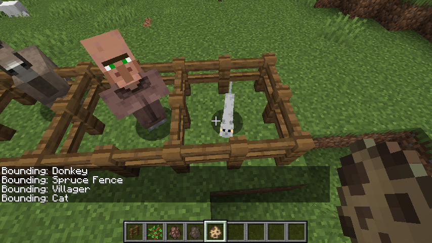

# Bounding Box Minecraft Mod

## Setup

For setup instructions please see the [fabric wiki page](https://fabricmc.net/wiki/tutorial:setup) that relates to the IDE that you are using.

## License

This template is available under the CC0 license. Feel free to learn from it and incorporate it in your own projects.
